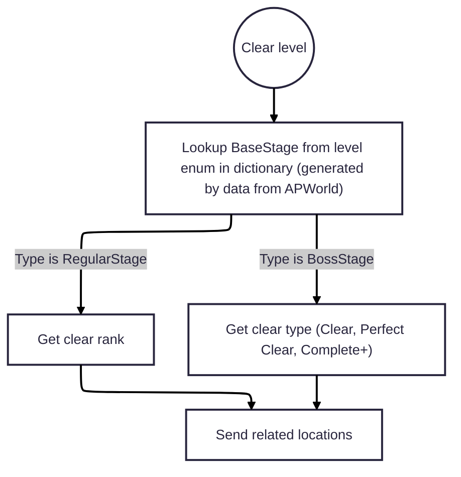

```mermaid
---
config:
  layout: elk
  theme: redux
---
flowchart TD
  clear_level(("Clear level"))
  --> get_basestage["Lookup BaseStage from level enum in dictionary (generated by data from APWorld)"]

  send_related_locations["Send related locations"]
  get_basestage
  -->|"Type is RegularStage"| get_regular_locations["Get clear rank"]
  --> send_related_locations

  get_basestage
  -->|"Type is BossStage"| boss_get_clear_type["Get clear type (Clear, Perfect Clear, Complete+)"]
  --> send_related_locations
```
