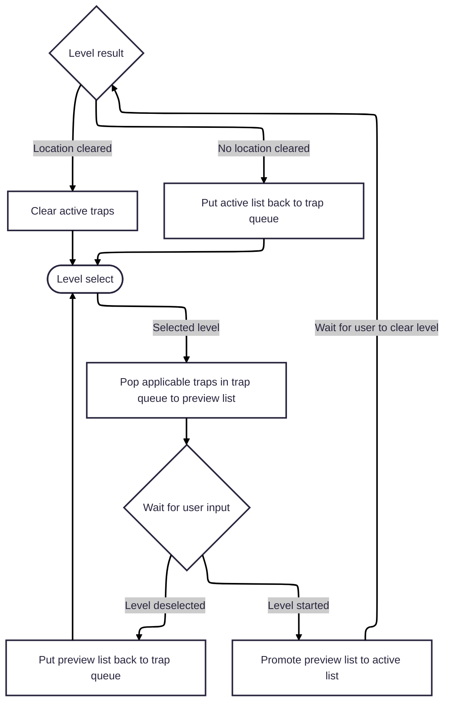

```mermaid
---
config:
  layout: elk
  theme: redux
---
flowchart TD
  level_select(["Level select"])
  -->|"Selected level"| preview_apply["Pop applicable traps in trap queue to preview list"]
  --> wait_user_input{"Wait for user input"}

  wait_user_input -->|"Level deselected"| preview_return["Put preview list back to trap queue"] --> level_select
  wait_user_input -->|"Level started"| active_apply["Promote preview list to active list"]
  -->|"Wait for user to clear level"| wait_clear_level{"Level result"}

  wait_clear_level -->|"Location cleared"| clear_active_traps["Clear active traps"]
  --> level_select
  wait_clear_level -->|"No location cleared"| active_return["Put active list back to trap queue"]
  --> level_select
```
